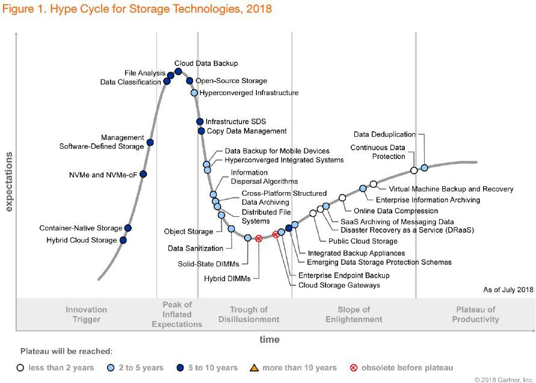

# Data Ingestion (데이터 수집)

최근에 갑자기 부서와 업무가 바뀌어 새롭게 공부를 시작하였다. 어찌보면 원론적으로 Cloud 기반기술보다 더 오래된 데이터 관련 업무를 수행해야 해서 급하기 몇주간 공부를 하고 있다. 이번 글에서는 데이터 수집하고 분산 스토리지에 저장하는 것을 정리해보고자 한다.

## 분산스토리지(distributed storage)에 저장하기

기본적으로 분산 스토리지는 우리가 흔히 말하는 Object Storage를 말한다. Hadoop에서는 HDFS를 사용하고 On-prem설치형으로는 Ceph, 클라우드서비스를 사용하면 S3등을 주로 많이 사용한다. 아래 그림처럼 2018년 Storage Hyper Cycle을 확인해보면 Object Storage는 내리막을 거쳐 성숙기에 접어들기 직전임을 알수 있다. 물론 Public Cloud Storage와 같이 프로바이더에서 제공하는 S3와 같은 분산 스토리지는 이미 성숙단계인 상태이다. 

Object Storage는 여러 컴퓨터에 파일를 여러 디스크에 복사 및 분산저장하고 데이터 양이 늘어나도 성능이 떨어지는 일이 발생하지 않는다. Block Storage하지만 통신이 대부분 HTTP프로토콜로 동작하므로 오버헤드가 크기 때문에 작은 파일에 사용하기에는 비효율적이다. 또한 HDFS도 마찬가지이지만 Update/Delete이 매우 어려운 구조로 구성되어 있기 때문에 직접 하나의 파일을 여러번 수정하는 용도로는 적합하지 않다.

뒤에서도 이야기 하겠지만 시계열데이터도 활용을 많이 하기 때문에 수시로 저장해야 하는 작은 데이터는 모아서 저장하고 큰 데이터는 여러개로 나누는 것이 좋다. 

데이터를 수집하고 나누거나 합친 데이터를 structured 데이터로 가공하고 분산 스토리지에 저장하는 일련의 행위들을 데이터 수집(Data Ingestion)이라고 할 수 있다. 

데이터 수집(Data Ingestion)은 보통 두가지 형태로 유입이 된다.
* 벌크(Bulk) - ETL작업을 통해 기존 데이터 소스에서 얻거나 다운로드 그대로 사용하는 데이터 집합
* 스트리밍(Streaming) - 예측을 위해 수집되고 있는 라이브 데이터  

## ETL(Extract Transform Load) or ELT(Extract Load Transform)

기존 데이터웨어하우스(DW)나 하둡에 있는 벌크 데이터는 SQL이나 API형태로 추출하는데 처음부터 분산 스토리지에 없는 경우 전송을 위해 ETL(혹은 ELT)서버를 구성해야 한다. 

추출(Extract), 변환(Transform), 그리고 적재(Load) 또는 추출(Extract), 적재(Load), 변환(Transform) 정답은 없지만  단순하게 우리가 별로 생각없이 말하는 ETL(ELT)이라고 함은 단순하지 않다. 변환(Transform)이라 함은 비정형데이터 또는 RDB의 정형데이터를 정리, 필터링, 정형(reshaping), 요약해서 데이터 사이언티스트가 분석이 용이하게 변환하는 일련의 모든 행위를 말한다. ETL 과정이 모든 과정중에 가장 많은 시간과 노력이 필요하다. 

가장 쉽게 설명하면 RDB에서 SQL쿼리를 통해 데이터를 추출(Extract)하고 ETL서버를 통해 csv파일 형태로 변환(Transform)하여 분산스토리지에 적재(Load) 하는것을 생각하면 된다. 아니면 Rest API를 통해 데이터를 추출(Extract)하는 방법도 생각해 볼 수 있다. 

## 스트리밍 데이터의 수집

약간의 지연이 있을수도 있지만 대부분의 작은 데이터들(머신로그, 어플리케이션로그, 메트릭)은 네트워크를 통헤 거의 실시간으로 전송을 하게 된다. 이를 처리하기 위해서는 위와 같이 벌크 도구를 활용하여 적재하기가 불가능하므로 스트리밍 형태의 데이트 전송이 필요하다.

위 그림은 여러 클라이언트에서 전송되는 방식을 아주 간단하게 도식화한 것이다. 기본적으로 HTTP(S) 통신방식을 활용하고 데이터 통신 오버헤드를 줄이기 위해 MQTT나 gRPC프로토콜을 사용하기도 한다. 

중간에 메시지 브로커 역할을 하는 Fluentd 나 Logstash등을 이용하여 버퍼를 통해 그림과 같이 분산스토리지나 시계열DB에 저장하기도 한다.

