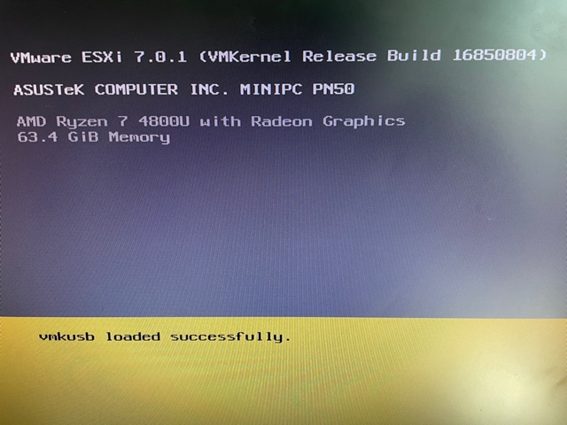
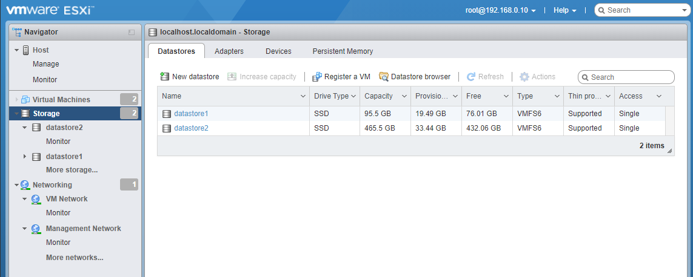

스타트업으로 이직후 정신없는 6개월을 보냈고 집에서 하는 사이드 프로젝트나 공부하는 것들이 소홀해지는것 같아 마음을 다잡고자 작성하는 포스팅이다. 최근 몇개월 간은 회사 블로그 글만 작성하다보니 개인 블로그를 거의 못하고 있어서 회사 제품과는 아직까지 거리가 있는 플랫폼 공부차 작성한다. 순수하게 정보공유차 작성하는 것이며, 특정회사의 회사의 제품이나 플랫폼을 홍보하고자 함은 아니다.

## Tanzu

https://tanzu.vmware.com/content/blog/simplify-your-approach-to-application-modernization-with-4-simple-editions-for-the-tanzu-portfolio


Tanzu는 애플리케이션을 개발, 구동, 운영하는 모든 컨테이너 환경을 통합 관리하는 쿠버네티스를 상용화 한 제품으로 이해하는 것이 가장 쉽다. 

  
http://www.bikorea.net/news/photo/202004/26520_15547_3837.jpg  
(출처 : VM웨어 코리아 발표자료 갈무리)

포트폴리오를 간단히 살펴보면 기존 인프라를 구성하는 레이어인 vSphere 위에 `VMware Tanzu Kubernetes Grid`를 볼 수 있다.  

오늘은 기존 Pivotal 이나 Spring Boot를 제외한 플랫폼 레이어의 TKG(Tanzu Kubernetes Grid)를 홈랩으로 구성하는 과정을 정리했다. 

모든 과정은 virtuallyGhetto 블로그를 참고하여 작성했고 가장 따라한 부분은 아래 포스팅이니 NUC으로 구성하려면 원문을 참고하면 된다.  
[https://www.virtuallyghetto.com/2020/11/complete-vsphere-with-tanzu-homelab-with-just-32gb-of-memory.html#comments](https://www.virtuallyghetto.com/2020/11/complete-vsphere-with-tanzu-homelab-with-just-32gb-of-memory.html#comments)

## 준비사항(Hardware)

* ASUS PN50
[https://www.asus.com/kr/Mini-PCs/Mini-PC-PN50/](https://www.asus.com/kr/Mini-PCs/Mini-PC-PN50/)

  PN50 베어본을 선택한 이유는 일단 AMD Ryzen 4800u CPU가 저전력인데도 불구하고 8코어 16스레드, 64GB sodimm이 지원되며, 2.5인치와 M.2 SSD가 동시 장착이 가능하다는 점이다. 온보드 NIC 드라이버가 vSphere 7.0에서 지원되지 않지만 USB Network Adapter를 통해 구성이 가능했기 때문에 망설임 없이 구매를 결정했다. 구입은 네이버 검색(asus pn50 4800u)을 통해 71만원 정도에 구매를 했다. 이도 스마일 캐시를 직접 구매해서 실제 구매금액은 65만원 정도가 소요되었다.

* SODIMM DDR4 32G PC4-25600 (TeamGroup)

  해당 제품은 가성비로 가장 저렴하게 살 수 있는 국내 워런티가 가능한 SODIMM 메모리로 32G 2개를 구매했으며 네이버 검색으로 2개 25만원 정도로 구매했다. 

* 2.5 SSD (ADATA SU655 240GB)
  ESXi 서버 설치용으로 사용하기 위해 기존에 갖고 있던 ADATA SU655 240GB를 사용했고 현재 3.5만원 정도에 구매가능하다. 

* M.2 SSD (WD BLACK SN750 M.2 NVMe 500GB)
  아마존에서 직구한 녀석으로 69.99달러 소요되었다. 배대지 가격을 합치면 8.5만원 정도 소요되었다. 

* Gigabit USB Lancard (tplink UE300C)
  ESXi 7.0버전에서 온보드 NIC 인식이 불가능한 이유로 별도로 기기비트 유선 랜카드를 구매했다. 1.5만원 정도에 구매가능 하고 3년 보증이 되는 TPLINK제품으로 선택하였다.  
  https://coupa.ng/bM0lN8 -> 해당 링크를 통해 구매하면 쿠팡 파트너스로 적립금이 지급되니 참고하기 바란다.

실제 위 스펙으로 대충 구매를 진행하게 되면 `104만원` 정도 소요가 된것으로 예상된다. 환율이나 할인을 전혀 받지 않고 구매를 한다고 가정해도 약 8코어 16스레드 64GB 머신을 `110만원` 정도로 구성이 가능하다. 물론 서버나 워크스테이션이나 NUC기반으로도 구성이 가능하지만 전력소모와 집안을 차지하는 부피를 고려하면 금액적으로 메리트가 있다고 생각한다.

## 준비사항(Software)

* Windows PC (with Powershell, WSL) or MAC
Window를 사용을 하지 않고 MAC이나 리눅스로 구성하려 했으나 온보드 NIC 인식을 위한 드라이버 통합 커스텀 이미지 작성 편의를 위해 Window 환경을 사용하였다.

* [ventoy](https://www.ventoy.net/en/index.html)  
  ESXi 부팅 이미지 제작을 위한 툴이며 [rufus](https://rufus.ie/)에 비해 활용도가 높다.
* [vSphere 7.0 Update 1](https://my.vmware.com/en/group/vmware/downloads/info/slug/datacenter_cloud_infrastructure/vmware_vsphere/7_0)  
  평가판은 [https://my.vmware.com/en/group/vmware/evalcenter?p=vsphere-eval-7](https://my.vmware.com/en/group/vmware/evalcenter?p=vsphere-eval-7) 에서 다운로드가 가능하다.
* [PowerShell 7.10](https://github.com/PowerShell/PowerShell/releases/tag/v7.1.0)  
  기본적으로 Window에는 6.x 버전의 PowerShell이 설치되어 있기 때문에 7.1.0 버전을 신규로 설치해야 한다.
* [PowerCLI](https://www.powershellgallery.com/packages?q=VMware.PowerCLI)  
  https://www.powershellgallery.com/packages/VMware.PowerCLI/12.1.0.17009493
  커스텀 ESXi 7.0 이미지 제작을 위함.
* [USB Network Native Driver for ESXi](https://flings.vmware.com/usb-network-native-driver-for-esxi?download_url=https%3A%2F%2Fdownload3.vmware.com%2Fsoftware%2Fvmw-tools%2FUSBNND%2FESXi701-VMKUSB-NIC-FLING-40599856-component-17078334.zip)  
  PN50 USB NIC(RTL8153) 인식을 위한 네이티브 드라이버 다운로드
* [OVFTool](https://my.vmware.com/group/vmware/downloads/details?downloadGroup=OVFTOOL440P01&productId=974)  
  OVA를 배포하기 위한 도구로 Linux 64 bundle로 WSL에 설치한다. 
* [vcsa-deploy](https://my.vmware.com/group/vmware/evalcenter?p=vsphere-eval-7)  
  vCenter를 배포하는 도구로 이미지내에 포함되어 있기 때문에 vCenter Server Appliance ISO를 다운받아 압축을 풀면 확인할 수 있다. 

## 최종 예상 구성요소
* vCenter Server Appliance
* VMFS Storage
* vSphere with Tanzu Cluster
* HAProxy
* Router (Forwarding, DNS)
* Supervisor Control Plane VMs

## ESXi 설치

초반에도 이야기 했듯이 ESXi 7.0이상에서는 ASUS PN50의 온보드 인터페이스를 사용하지 못한다. 그래서 별도로 구매한 USB 인터페이스의 RTL8153 칩셋을 이미지에 통합시키는 작업이 필요하다.  

드라이버 이미지 통합을 위한 내용은 아래 포스팅을 참고했다.  
* [https://www.virten.net/2020/09/esxi-on-amd-ryzen-based-asus-pn50/](https://www.virten.net/2020/09/esxi-on-amd-ryzen-based-asus-pn50/)
* [https://www.virten.net/2020/04/how-to-add-the-usb-nic-fling-to-esxi-7-0-base-image/](https://www.virten.net/2020/04/how-to-add-the-usb-nic-fling-to-esxi-7-0-base-image/)

### ESXi 다운로드

다음 링크에서 `VMware vSphere 7.0 Update 1` 를 다운로드 한다.  
* [https://my.vmware.com/en/group/vmware/downloads/info/slug/datacenter_cloud_infrastructure/vmware_vsphere/7_0](https://my.vmware.com/en/group/vmware/downloads/info/slug/datacenter_cloud_infrastructure/vmware_vsphere/7_0)

기본적으로 VMware 회원가입이 필요하며 라이센스가 없는 경우 60일 trial로 가능하다.  
* [https://my.vmware.com/en/group/vmware/evalcenter?p=vsphere-eval-7](https://my.vmware.com/en/group/vmware/evalcenter?p=vsphere-eval-7)

### USB Network Native Driver for ESXi

USB NIC Fling 드라이버를 준비한다. 

* [https://flings.vmware.com/usb-network-native-driver-for-esxi?download_url=https%3A%2F%2Fdownload3.vmware.com%2Fsoftware%2Fvmw-tools%2FUSBNND%2FESXi701-VMKUSB-NIC-FLING-40599856-component-17078334.zip
](https://flings.vmware.com/usb-network-native-driver-for-esxi?download_url=https%3A%2F%2Fdownload3.vmware.com%2Fsoftware%2Fvmw-tools%2FUSBNND%2FESXi701-VMKUSB-NIC-FLING-40599856-component-17078334.zip)

### PowerShell 7.1.0 설치

기본적으로 Window에는 6.x 버전의 PowerShell이 설치되어 있기 때문에 7.1.0 버전을 신규로 설치해야 한다.  

* [https://github.com/PowerShell/PowerShell](https://github.com/PowerShell/PowerShell)


### PowerCLI 준비

PowerCLI 다운로드 및 설치
* [https://www.powershellgallery.com/packages/VMware.PowerCLI/12.1.0.17009493](https://www.powershellgallery.com/packages/VMware.PowerCLI/12.1.0.17009493)

관리자 권한으로 PowerShell을 실행하고 PowerCLI 모듈 설치전에 실행 권한을 수정한다. (참고 : [https://docs.microsoft.com/en-us/powershell/module/microsoft.powershell.core/about/about_execution_policies?view=powershell-7.1](https://docs.microsoft.com/en-us/powershell/module/microsoft.powershell.core/about/about_execution_policies?view=powershell-7.1) )

```powershell
Set-ExecutionPolicy -ExecutionPolicy RemoteSigned
```

PowerCLI를 설치한다.
```powershell
Install-Module -Name VMware.PowerCLI -Scope CurrentUser
```

### Image Profile 확인
포스팅을 하는 20년 11월 29일 최신 ESXi 이미지는 `ESXi-7.0U1b-17168206-standard`로 vSphere ESXi 7.0 이미지 프로필은 아래에서 확인이 가능하다.  
* [https://www.virten.net/vmware/vmware-esxi-image-profiles/](https://www.virten.net/vmware/vmware-esxi-image-profiles/)

stable 릴리스로 구성하기 위해 `ESXi-7.0.1-16850804-standard` 이미지 프로필로 설치를 진행한다.  

설치 프로세스를 살펴보면 `Add-EsxSoftwareDepot`로 repo설정을 하고 `Export-ESXImageProfile`를 통해 원하는 이미지 프로필의 bundle을 다운로드 받는다. 위에서 다운로드 받은 드라이버를 `Add-EsxSoftwarePackage`로 패키지를 추가하고 새로운 ISO이미지를 생성하는 과정을 알 수 있다.  

이미지 프로필 변경을 통해 원하는 이미지 버전으로 구성이 가능하다.  

```powershell
Add-EsxSoftwareDepot https://hostupdate.vmware.com/software/VUM/PRODUCTION/main/vmw-depot-index.xml
Export-ESXImageProfile -ImageProfile "ESXi-7.0.1-16850804-standard" -ExportToBundle -filepath  ESXi-7.0.1-16850804-standard.zip
Remove-EsxSoftwareDepot https://hostupdate.vmware.com/software/VUM/PRODUCTION/main/vmw-depot-index.xml
Add-EsxSoftwareDepot .\ESXi-7.0.0-15843807-standard.zip
Add-EsxSoftwareDepot .\ESXi701-VMKUSB-NIC-FLING-40599856-component-17078334.zip
New-EsxImageProfile -CloneProfile "ESXi-7.0.1-16850804-standard" -name "ESXi-7.0.1-16850804-USBNIC" -Vendor "virten.net"
Add-EsxSoftwarePackage -ImageProfile "ESXi-7.0.1-16850804-USBNIC" -SoftwarePackage "vmkusb-nic-fling"
Export-ESXImageProfile -ImageProfile "ESXi-7.0.1-16850804-USBNIC" -ExportToIso -filepath ESXi-7.0.1-16850804-USBNIC.iso
Export-ESXImageProfile -ImageProfile "ESXi-7.0.1-16850804-USBNIC" -ExportToBundle -filepath ESXi-7.0.1-16850804-USBNIC.zip
```

### ESXi 설치 이미지 제작

ESXi 부팅 이미지 제작은 [rufus](https://rufus.ie/), [ventoy](https://www.ventoy.net/en/index.html) 둘 중 편한 도구로 선택하면 되는데 ventoy가 조금 더 활용도가 높다고 판단하여 진행했고, OS설치 USB 생성은 생략하도록 한다. 

### 부팅 및 설치 

일반적인 바이오스 설정과 동일하게 Boot 우선순위를 USB로 설정하고 다음과 같은 ventoy화면에서 앞서 생성한 `ESXi-7.0.1-16850804-USBNIC.iso` 이미지로 ESXi 설치를 진행한다.


https://nuanceofiqlusion.files.wordpress.com/2020/07/ventoymainmenu-e1594484932538.png  


이후 친숙한 DCUI(Direct Console User Interface)로 접속하여 Static IP 설정과 network 테스트를 진행한다.



### vSphere Web Client 접속

설정한 Static IP로 접속하여 환경을 점검한다.  


Management Network에 vSwitch0이 구성된 것을 확인할 수 있다.  

그리고 설치한 M.2 SSD로 datastore2를 추가하여 vCenter 설치를 진행하도록 한다.



## Router 설치 및 환경 구성

Router VM은 DNS 서버의 역할뿐 아니라 앞으로 구성될 내부 네트워크(10.10.0.0/24 & 10.20.0.0/24)와 외부 네트워크의 포워딩과 NAT 역할을 수행한다.  

Photon OS 3.0 OVA로 배포되며 [OVFTool](https://my.vmware.com/group/vmware/downloads/details?downloadGroup=OVFTOOL440P01&productId=974)를 사용하여 배포를 진행하는데 이미 작성된 배포 스크립트를 활용한다. 

* [Photon OS 3.0 OVA](https://packages.vmware.com/photon/3.0/Rev3/ova/photon-hw13_uefi-3.0-a383732.ova)

* [https://github.com/lamw/vsphere-with-tanzu-homelab-scripts](https://github.com/lamw/vsphere-with-tanzu-homelab-scripts.git)


### Router 설치

스크립트 실행은 동일한 PowerShell이 동작하는 Window WSL2 환경에서 수행했기 때문에 WSL환경의 `/etc/hosts` 파일에 아래와 같이 사용하고자 하는 IP주소를 미리 등록해놓는다.  

```
192.168.0.10    esxi-01.tanzu.local
192.168.0.201   router.tanzu.local
192.168.0.202   vcsa.tanzu.local
192.168.0.203   haproxy.tanzu.local
```

해당 레포의 `deploy_photon_router_ova.sh`를 자신의 환경에 맞게 수정한다. WSL내에서 Window 시스템내에 다운로드한 OVA파일 경로는 `/mnt/c/esxi/photon-hw13_uefi-3.0-a383732.ova`로 변경하였다. Router와 ESXi hostname, password등을 확인하고 Network과 Datastore는 위에서 확인한 내용으로 수정한다.

```sh
#!/bin/bash
# William Lam
# www.virtuallyghetto

PhotonOVA="/mnt/c/esxi/photon-hw13_uefi-3.0-a383732.ova"
PhotonRouterVMName="router.tanzu.local"
ESXiHostname="esxi-01.tanzu.local"
ESXiUsername="root"
ESXiPassword='VMware1!'

PhotonRouterNetwork="VM Network"
PhotonRouterDatastore="datastore1"

### DO NOT EDIT BEYOND HERE ###

ovftool \
--name=${PhotonRouterVMName} \
--X:waitForIpv4 \
--powerOn \
--acceptAllEulas \
--noSSLVerify \
--datastore=${PhotonRouterDatastore} \
--net:"None=${PhotonRouterNetwork}" \
${PhotonOVA} \
"vi://${ESXiUsername}:${ESXiPassword}@${ESXiHostname}"
```

스크립드를 실행하면 OVA파일을 배포하게 된다.  

```sh
$ ./deploy_photon_router_ova.sh
Opening OVA source: /mnt/c/esxi/photon-hw13_uefi-3.0-a383732.ova
The manifest validates
The provided certificate is in valid period
Source is signed and the certificate validates
Certificate information:
  CertIssuer:/C=US/ST=California/L=Palo Alto/O=VMware, Inc.
  CertSubject:/C=US/ST=California/L=Palo Alto/O=VMware, Inc.
  -----BEGIN CERTIFICATE-----
  ...
  -----END CERTIFICATE-----


Warning:
 - Line -1: Unsupported value 'uefi.secureBoot.enabled' for attribute 'key' on element 'ExtraConfig'.
Opening VI target: vi://root@esxi-01.tanzu.local:443/
Deploying to VI: vi://root@esxi-01.tanzu.local:443/
Transfer Completed
Powering on VM: router.tanzu.local
Task Completed
Received IP address: 192.168.0.47
Completed successfully
```

위와 같이 DHCP를 통해 임의의 주소(192.168.0.47)를 할당 받게 되고 해당 IP로 SSH접속하여 기본 패스워드(`changeme`)를 원하는 패스워드로 변경한다.

```sh
$ ssh root@192.168.0.47
The authenticity of host '192.168.0.47 (192.168.0.47)' can't be established.
ECDSA key fingerprint is SHA256:ESpN1DMTIu9PKWW4QZIYs4DZ602SsdhjxEYhugkmi+g.
Are you sure you want to continue connecting (yes/no/[fingerprint])? yes
Warning: Permanently added '192.168.0.47' (ECDSA) to the list of known hosts.
Password:
Password:

cat > /etc/systemd/network/10-static-eth0.network << EOF
You are required to change your password immediately (administrator enforced)
Changing password for root.
Current password:
New password:
Retype new password:
 08:58:54 up 32 min,  0 users,  load average: 0.00, 0.00, 0.00
tdnf update info not available yet!
root@photon-machine [ ~ ]#
root@photon-machine [ ~ ]# exit
logout
Connection to 192.168.0.47 closed.
```

### Router 환경 구성

위 스크립트 [레포지토리](https://github.com/lamw/vsphere-with-tanzu-homelab-scripts)에서 DNS역할, 포워딩을 수행하도록 [`setup_photon_router.sh`](https://github.com/lamw/vsphere-with-tanzu-homelab-scripts/blob/master/setup_photon_router.sh)를 수정한다. 

* PHOTON_ROUTER_IP=192.168.0.201 : Router 설정할 IP
* PHOTON_ROUTER_GW=192.168.0.1 : Router의 게이트웨이
* PHOTON_ROUTER_DNS=192.168.0.1 : Router의 Forwader DNS
* SETUP_DNS_SERVER=1 : Router가 클러스터 내 DNS 역할을 수행

위 설정 이외에도 추후 내부 네트워크 구성을 위한 iptables 구성이 포함되어 있다.  

```sh
#!/bin/bash

PHOTON_ROUTER_IP=192.168.0.201
PHOTON_ROUTER_GW=192.168.0.1
PHOTON_ROUTER_DNS=192.168.0.1
SETUP_DNS_SERVER=1

tdnf -y update
if [ ${SETUP_DNS_SERVER} -eq 1 ]; then
    tdnf install -y unbound

    cat > /etc/unbound/unbound.conf << EOF
    server:
        interface: 0.0.0.0
        port: 53
        do-ip4: yes
        do-udp: yes
        access-control: 192.168.0.0/24 allow
        access-control: 10.10.0.0/24 allow
        access-control: 10.20.0.0/24 allow
        verbosity: 1

    local-zone: "tanzu.local." static

    local-data: "router.tanzu.local A 192.168.0.201"
    local-data-ptr: "192.168.0.201 router.tanzu.local"

    local-data: "vcsa.tanzu.local A 192.168.0.202"
    local-data-ptr: "192.168.0.202 vcsa.tanzu.local"

    local-data: "haproxy.tanzu.local A 192.168.0.203"
    local-data-ptr: "192.168.0.203 haproxy.tanzu.local"

    local-data: "esxi-01.tanzu.local A 192.168.0.10"
    local-data-ptr: "192.168.0.10 esxi-01.tanzu.local"
...
```

해당 스크립트를 수행하고 나면 IP가 변경되고 외부에서도 Router DNS를 통해 쿼리가 가능한것을 확인할 수 있다.  

```powershell
PS C:\Users\rokak> nslookup vmware.com 192.168.0.201
서버:    router.tanzu.local
Address:  192.168.0.201

권한 없는 응답:
이름:    vmware.com
Addresses:  2a02:e980:b5::b7
          2a02:e980:b1::b7
          45.60.101.183
          45.60.11.183
```

### VCSA(vCenter Server Appliance) 배포 및 구성

`vcsa-deploy`를 사용하여 배포를 진행한다. 먼저 VCSA 7.0 Update 1 ISO를 다운로드한다.  
* [https://my.vmware.com/group/vmware/evalcenter?p=vsphere-eval-7](https://my.vmware.com/group/vmware/evalcenter?p=vsphere-eval-7]

위 스크립트 [레포지토리](https://github.com/lamw/vsphere-with-tanzu-homelab-scripts)에서 [`vcsa.tanzu.local.json`](https://github.com/lamw/vsphere-with-tanzu-homelab-scripts/blob/master/vcsa.tanzu.local.json)를 수정한다.  

패스워드, Network와 Datastore를 설정하고 DNS서버를 Router IP로 변경한다. 나머지는 기본값으로 설정한다. 

```json
{
            ...
            "deployment_network": "VM Network",
            "datastore": "datastore2"
        },
        "appliance": {
            "__comments": [
            ...
            ],
            "thin_disk_mode": true,
            "deployment_option": "tiny",
            "name": "vcsa.tanzu.local"
        },
        "network": {
            "ip_family": "ipv4",
            "mode": "static",
            "system_name": "vcsa.tanzu.local",
            "ip": "192.168.0.202",
            "prefix": "24",
            "gateway": "192.168.0.1",
            "dns_servers": [
                "192.168.0.201"
            ]
        },
    ...
}
```

위에서 다운로드 받았던 VCSA ISO를 압축을 풀고 위 스크립트를 참조하여 배포 명령을 실행한다. 

```
$ cd VMware-VCSA-all-7.0.1-17004997/
$ ./vcsa-deploy install --accept-eula --acknowledge-ceip --no-ssl-certificate-verification /mnt/c/esxi/vsphere-with-tanzu-homelab-scripts/vcsa.tanzu.local.json
```

vCenter가 설치가 완료된 후 SSH로 접속한다. 기본 Shell이 Bash가 아니므로 `shell` 명령으로 접속한후 `chsh -s /bin/bash`로 기본 Shell을 Bash로 변경한다.  

```sh
$ ssh root@192.168.0.202
The authenticity of host '192.168.0.202 (192.168.0.202)' can't be established.
ECDSA key fingerprint is SHA256:oMr5nJ9RDeZS9E3m586kSFDoNXM76yNiLYaIyDQ6ca4.
Are you sure you want to continue connecting (yes/no/[fingerprint])? yes
Warning: Permanently added '192.168.0.202' (ECDSA) to the list of known hosts.

VMware vCenter Server 7.0.1.00100

Type: vCenter Server with an embedded Platform Services Controller

root@192.168.0.202's password:
Connected to service

    * List APIs: "help api list"
    * List Plugins: "help pi list"
    * Launch BASH: "shell"

Command>
Command> shell
Shell access is granted to root
root@vcsa [ ~ ]# chsh -s /bin/bash
```

### VCSA 설정 변경

메모리 절약을 위해 마스터 노드 개수를 변경한다. `/etc/vmware/wcp/wcpsvc.yaml` 에서 `clusterconfig.minmasters` 와 `clusterconfig.maxmasters` 값을 2로 변경하면 된다. 자세한 내용은 다음 링크를 참조한다.

* [https://www.virtuallyghetto.com/2020/04/deploying-a-minimal-vsphere-with-kubernetes-environment.html](https://www.virtuallyghetto.com/2020/04/deploying-a-minimal-vsphere-with-kubernetes-environment.html)

그리고 VCSA VM을 shutdown하고 메모리를 12GB에서 8GB로 변경하고 재기동한다. 

```yaml
logging:
  level: debug
  maxsizemb: 10
# By default, WCP Agent VM OVF URL points to the ovf bundled in vCSA, served
# through lighttpd web server. To override it, set kubevmconfig.ovfurl param.
#kubevm:
#  ovfurl: 'https://this_vc_pnid:5480/wcpagent/photon-ova-%%SIZE%%.ovf'
#  apiserverport: 6443
#  authproxyport: 443
rhttpproxy_port: 443
clusterconfig:
  minmasters: 2
  maxmasters: 2
  disable_ssl: false
  namespace_graceful_disable_duration: 1800
  upgrade_precheck_timeout: 300
# force_upgrade_clusters:
  force_version_for_enable: v1\.18\..*
  logging_fluentbit_enabled: false
# logging_fluentbit_rsyslog: ""
csisetting:
   csi_enabled: true
hdcsconfig:
  ovf_url: 'file:///storage/lifecycle/vmware-hdcs'
```

vCenter UI사용을 위해 [`setup_vcsa.ps1`](https://github.com/lamw/vsphere-with-tanzu-homelab-scripts/blob/master/setup_vcsa.ps1) 스크립트를 수정한다.  

```powershell
PS C:\esxi\vsphere-with-tanzu-homelab-scripts> .\setup_vcsa.ps1
Connect-VIServer: C:\esxi\vsphere-with-tanzu-homelab-scripts\setup_vcsa.ps1:17
Line |
  17 |  $vc = Connect-VIServer $VCSAHostname -User $VCSAUsername -Password $V …
     |        ~~~~~~~~~~~~~~~~~~~~~~~~~~~~~~~~~~~~~~~~~~~~~~~~~~~~~~~~~~~~~~~
     | 2020-11-30 오전 12:45:18 Connect-VIServer  The SSL connection could not be established,
     | see inner exception.
```

위와 같이 SSL connection 에러가 발생하기 때문에 인증서 체크를 무시하는 설정을 한다. 

```powershell
PS C:\esxi\vsphere-with-tanzu-homelab-scripts> Set-PowerCLIConfiguration -InvalidCertificateAction:Ignore
```

`$VCSAPassword`, `$DatastoreName`, `$ESXiPassword` 등을 수정하고 스크립트를 실행한다.

```powershell
PS C:\esxi\vsphere-with-tanzu-homelab-scripts> .\setup_vcsa.ps1
```

일단 여기 까지 정리하고 내일 마무리하는 걸로!


## 정리
